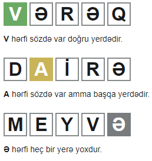

# **Wordle🇦🇿 Azərbaycan dilində**

https://wordleaz.synetrix.in/

---

Orijinal oyunun müəllifi: Josh Wardle. ingilis dilində oynaya bilərsiniz.

https://www.nytimes.com/games/wordle/index.html

---

Mənə maraqlı idi ki, bəs Azərbaycan dilində neçə 5 hərfdən ibarət söz tapmaq olar? Buna görə də Azərbaycan versiyasını etdim. Bir neçə lüğətdən istifadə etdim və onlardan 5 hərfli sözlər çıxartdım. 4873 söz oldu. Bu sözlərdən 1469-u  gündəlik istifadə etdiyimiz, 3404-u isə çox istifadə edilməyən (ağıla gəlməz 😊) sözlərdir.

Söz bazası *wordbase* papkasının içində txt fayldadır.

---

## Qaydalar

Hər bir söz **BEŞ** hərfdən ibarətdir və siz bu sözü **ALTI** cəhdə tapmalısınız!

Hər cəhdən sonra xananın rəngi dəyişəcək və yazdığınız sözün nəzərdə tutulmuş sözə nə qədər yaxın olduğunu göstərəcək.

### Nümunə

