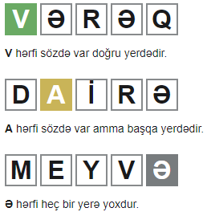

# Wordle🇦🇿 Azərbaycan dilində

**Play it:** https://wordleaz.synetrix.in/

A daily five-letter word game in Azerbaijani, based on Wordle.

Original game by **Josh Wardle** — play the English original at
https://www.nytimes.com/games/wordle/index.html

---

## About

Azerbaijani is an agglutinative language with a rich set of five-letter words,
so a Wordle version felt like an obvious fit. A few dictionaries were merged,
filtered down and split into two groups:

| Group | Count | What it is used for |
| --- | --- | --- |
| Daily answers | **1 469** | the pool the daily word is drawn from |
| Extra accepted guesses | **3 403** | rare / obscure words you may type, but that never appear as the answer |
| **Total accepted words** | **4 872** | |

`wordbase/words_base.txt` holds the raw merged dictionary
(**65 726** entries, 806 KB). Exactly 4 872 of those entries are five letters
long and use only the 32 letters of the Azerbaijani alphabet — that is the set
the game uses, and every one of them ended up in one of the two lists above.
The file is kept in the repository as the reference the lists were derived from;
it is **not loaded by the game at runtime**.

## Rules

Every word is **FIVE** letters long and you have **SIX** tries to find it.

After each guess the colour of the boxes changes, showing how close your guess
was to the hidden word.



- 🟩 the letter is in the word **and** in the right place
- 🟨 the letter is in the word but in a different place
- ⬜ the letter does not appear in the word

A new word is released every day at local midnight; the countdown inside the
statistics dialog tells you when. Progress, statistics and settings are stored
in the browser (`localStorage`) — there is no account and no server.

---

## Project structure

```
index.html    page shell: meta tags, global CSS, consent bar, service worker registration
main.js       the whole game (see the header comment inside the file)
consent.js    Google Analytics consent bar
sw.js         service worker: offline play + installability
manifest.json PWA manifest (icons, colours, start URL)
tools/        developer scripts (word lists, icons) - Python, not shipped
wordbase/     the word base, as one word per line text files
images/       icons and social preview image
assets/       screenshots used by this README
LICENSE       MIT, for this project's own work
NOTICE.md     provenance, trademark disclaimer, third-party material
```

`main.js` is a single pre-compiled ES5 bundle (originally transpiled from the
official Wordle sources with Babel). It is edited directly — **there is no build
step**. Read the large comment at the top of the file first: it maps every
section, explains the game loop and lists the invariants that must not be
broken. The file is heavily commented in English.

---

## Running it locally

The service worker and the manifest only work over `http(s)`, not over `file://`,
so start a tiny web server from the repository root:

```bash
python -m http.server 8000
# then open http://localhost:8000/
```

Opening `index.html` directly in a browser also works for the game itself; the
service worker registration is skipped automatically in that case.

---

## Maintaining the word lists

The two word lists exist in **two places**, and this is the single most
important thing to understand about this repository:

| Source of truth (edit this) | Generated copy (never edit) |
| --- | --- |
| `wordbase/main_words.txt` | the `options` array in `main.js` |
| `wordbase/examination_words.txt` | the `updatedSet` array in `main.js` |

Edit the text files, then regenerate the arrays:

```bash
python tools/build_wordlists.py            # rewrite both arrays in main.js
python tools/build_wordlists.py --check    # report only, change nothing
python tools/validate_wordlists.py         # full validation report
```

`build_wordlists.py` refuses to touch `main.js` while any word is invalid, and
both scripts share the same rules (`tools/wordlists.py`), so "check" and
"build" can never disagree.

### Rules every entry must satisfy

- exactly **5 characters**;
- only the 32 letters of the Azerbaijani alphabet (the `choices` string);
- **lowercase** — the game lowercases every keystroke, so an uppercase entry
  could never be typed by a player;
- no duplicates.

### Why this tooling exists

Two real bugs came from the old hand-edited arrays:

1. `dəng:` — a colon inside a daily answer. The colon has no key on the
   keyboard, so that day was **impossible to win**. It was served on
   2024-08-12 and would have returned every 1 469 days.
2. `çökə2`, `qart3`, `zınq2` (digits) and `Ağyol`, `Allah`, `Quran`, `Zühəl`
   (uppercase) in the guess list — dead entries no player could ever type.

Both are fixed, and the validator now rejects them before they can ship.

### ⚠️ The order of `main_words.txt` matters

The daily word is chosen deterministically, without a server:

```
dayOffset = whole days since 2022-01-16 (local time)
index     = (dayOffset * 26641) % 1469
answer    = main_words.txt[index]
```

Because 26 641 and 1 469 are coprime, the cycle visits all 1 469 answers before
repeating. Consequences for anyone editing the list:

- **fixing a word in place is safe** — the length stays the same;
- **inserting or removing an entry is not**: it shifts every future puzzle, so
  players would see words they have already played.
  `build_wordlists.py` warns loudly when the length changes.

As a safety net, `isDate()` in `main.js` also skips any answer that contains a
character the keyboard cannot produce, so a bad entry can no longer make a day
unwinnable even if validation is bypassed.

---

## Icons

The extra icons the manifest and iOS need are generated from the 512×512 logo:

```bash
pip install Pillow
python tools/build_icons.py
```

This writes `images/wordleaz_logo_180x180.png` (apple-touch-icon) and
`images/maskable_512x512.png` (Android maskable icon, artwork inside the 80%
safe zone).

---

## Privacy and analytics

The site uses Google Analytics 4 with Consent Mode v2, configured in
`index.html`:

- every consent flag starts as `denied`, so no cookie is written and no event
  is sent until the visitor accepts the bar;
- the decision is stored under the `analyticsConsent` key in `localStorage` and
  can be withdrawn by deleting that key;
- advertising features are disabled;
- **the daily answer is never sent to analytics.** The `level_start` /
  `level_end` events carry only the puzzle number, the number of tries and
  whether the game was won.

All game data (progress, statistics, theme, hard mode) stays on the device in
`localStorage` under the keys `gameState`, `statistics`, `darkTheme` and
`colorBlindTheme`.

---

## Deploying

1. Run `python tools/validate_wordlists.py` — it must print *All checks passed*.
2. If the app shell changed, bump `CACHE_VERSION` in `sw.js`.
3. Upload the files. No compilation needed.

Static hosting (Netlify, Vercel, GitHub Pages, any web server) works as is. The
manifest uses relative paths (`"start_url": "./"`), so the game can be served
from a sub-directory too. Keep the domain in the `og:*` / `twitter:*` tags and
in `index.html` in sync with wherever it is deployed — those URLs **must** be
absolute, otherwise social previews silently show no image.

---

## Testing checklist

There is no automated test suite for the UI; a change is verified like this:

1. `python tools/validate_wordlists.py` → *All checks passed*.
2. `python tools/build_wordlists.py --check` → *already up to date*.
3. Open the page and check the browser console stays empty.
4. Play one round: type a word, submit it, confirm the colours, then reload the
   page and confirm the game is restored.
5. Toggle *Çətin variant* in the settings and confirm an ignored hint is
   rejected.
6. Toggle *Qaranlıq mod* and *Kontrast rənglər* and confirm the palette changes.

---

## Known limitations / future work

- **`main.js` is one 210 KB generated bundle.** It is commented, but it is still
  minified ES5 and painful to review. Splitting it into readable ES modules with
  a bundler is the biggest remaining improvement; it needs its own change with
  careful testing, because there is no test suite to catch regressions.
- **Bundle size.** The two word lists (~38 KB of the file) are embedded in the
  JavaScript. They could be fetched from `wordbase/*.txt` at startup, which
  would also remove the duplication between the text files and the arrays — at
  the cost of one extra request and a loading state.
- **No automated tests.** The word-list tooling is the only part covered by
  scripts.
- **Day boundary is local time.** Two players in different time zones can be on
  different puzzles at the same moment. This matches the original game, but it
  means results are not perfectly comparable worldwide.

---

## License

| What | License |
| --- | --- |
| This project's own work — `tools/`, `index.html`, `consent.js`, `sw.js`, `manifest.json`, `images/`, this README | [MIT](LICENSE) |
| The word base — `wordbase/` | [CC BY 4.0](wordbase/LICENSE) |
| The `Wordle` name, logo and trademark | The New York Times Company — not granted |
| The game engine in `main.js` | Derived from the original Wordle client by Josh Wardle — **not** licensed here |

`main.js` is a bundle of the original Wordle client, which was never released
under an open-source license, so it is deliberately excluded from the MIT grant:
the author of this repository is not its copyright holder. The word base is
licensed separately because data licensing works differently from code.

**See [NOTICE.md](NOTICE.md) for the full provenance**, the trademark
disclaimer and the list of third-party material. This is an unofficial,
non-commercial fan adaptation and is not affiliated with The New York Times.
